<html lang="en">
<head>
  <meta charset="UTF-8">
  <title>Photo Grid</title>
  
</head>
<body>

  

    

      CπC1
      Valencia, Spain, 21-23.01.2010
      
Organizer: Begoña Milián-Medina, Johannes Gierschner Participants: 24

      
    

    

      
    

  

  

    

      CπC2
      Limoges, France, 03-05.02.2011
      
Organizer: Patrick Trouillas Participants: 36

      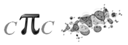
    

    

      
    

  

  

    

      CπC3
      Mons, Belgium, 02-04.02.2012
      
Organizer: Yoann Olivier Participants: 58

      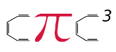
    

    

      <a href="#" onclick="openImagePopup('assets/images/cpic3_large.png', event)">
        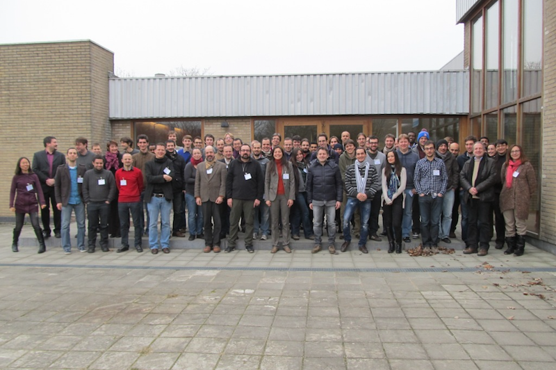
      </a>
    

  

  

    

      CπC4
      Marseille, France, 31.01-02.02.2013
      
Organizer: Philippe Marsal Participants: 28

      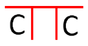
    

    

      <a href="#" onclick="openImagePopup('assets/images/cpic4_large.jpg', event)">
        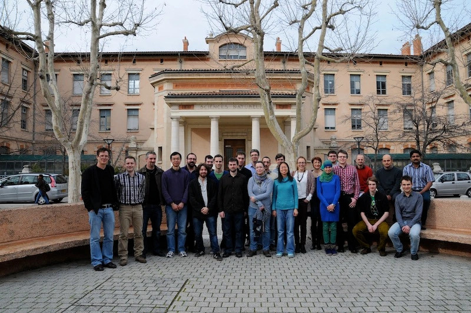
      </a>
    

  

  

    

      CπC5
      Linköping, Sweden, 05-07.02.2014
      
Organizer: Mathieu Linares Participants: 43

      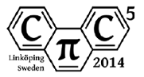
    

    

      <a href="#" onclick="openImagePopup('assets/images/cpic5_large.jpg', event)">
        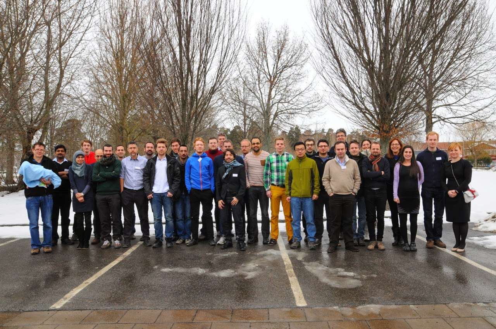
      </a>
    

  

  

    

      CπC6
      Olomouc, Czech Republic, 05-07.02.2015
      
Organizer: Michal Otyepka, Karel Berka Participants: 48

      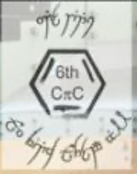
    

    

      <a href="#" onclick="openImagePopup('assets/images/cpic6_large.jpg', event)">
        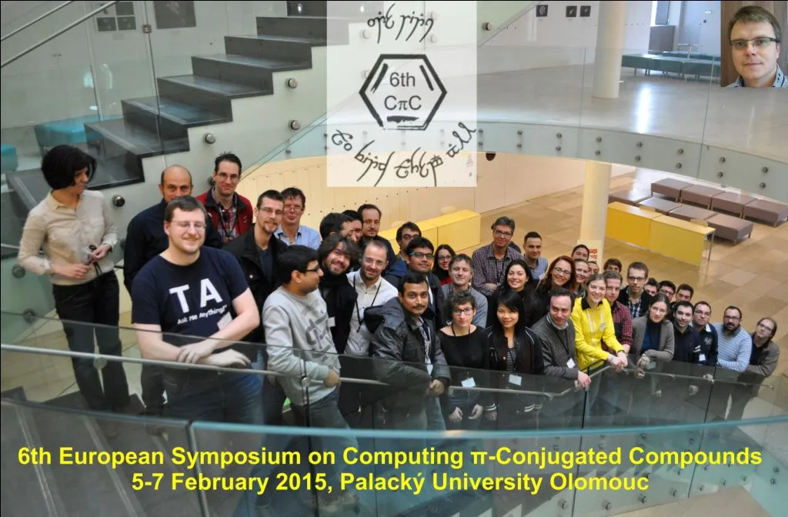
      </a>
    

  

  

    

      CπC7
      Bordeaux, France, 12-13.02.2016
      
Organizer: Luca Muccioli, Frédéric Castet, Lionel Truflandier Participants: 56

      
    

    

      
    

  

  

    

      CπC8
      Malaga, Spain, 26-28.01.2017
      
Organizer: Ma C. Ruiz Delgado, J. C. Sancho Garcia Participants: 62

      
    

    

      <a href="#" onclick="openImagePopup('assets/images/cpic8_large.jpg', event)">
        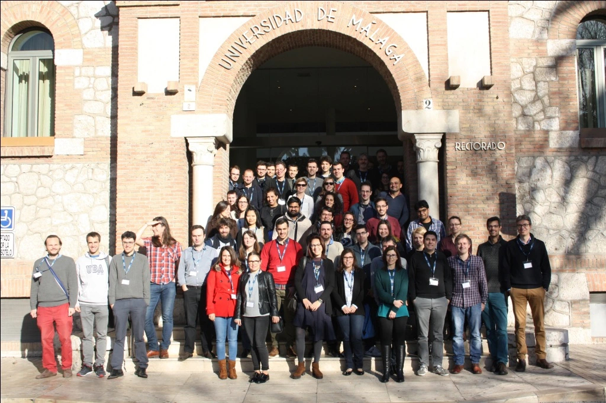
      </a>
    

  

  

    

      CπC9
      Napoli, Italy, 18-20.01.2018
      
Organizer: Roberto Improta Participants: 45

      
    

    

      <a href="#" onclick="openImagePopup('assets/images/cpic9_large.jpg', event)">
        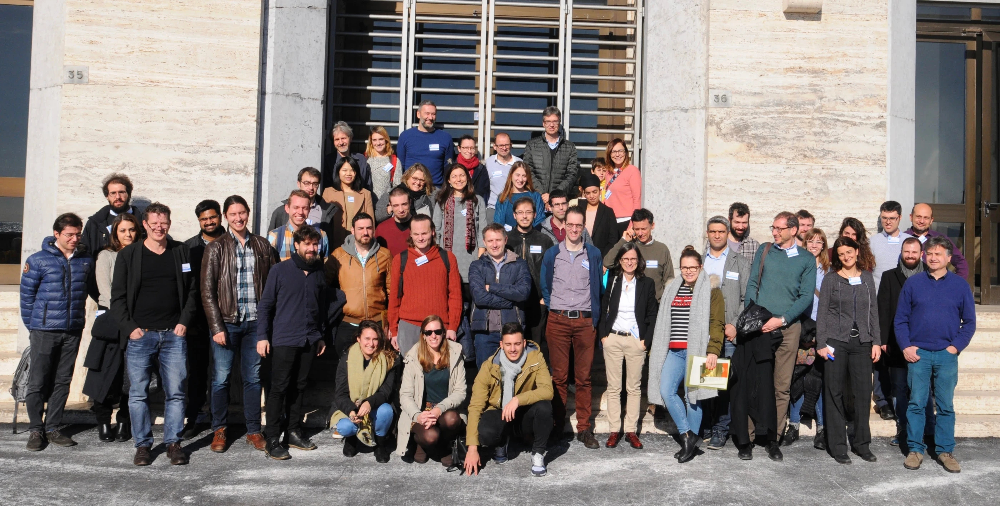
      </a>
    

  

  

    

      CπC10
      Valencia, Spain, 01-02.02.2019
      
Organizer: Begoña Milián-Medina, Johannes Gierschner Participants: 52

      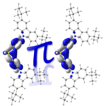
    

    

      <a href="#" onclick="openImagePopup('assets/images/cpic10_large.jpg', event)">
        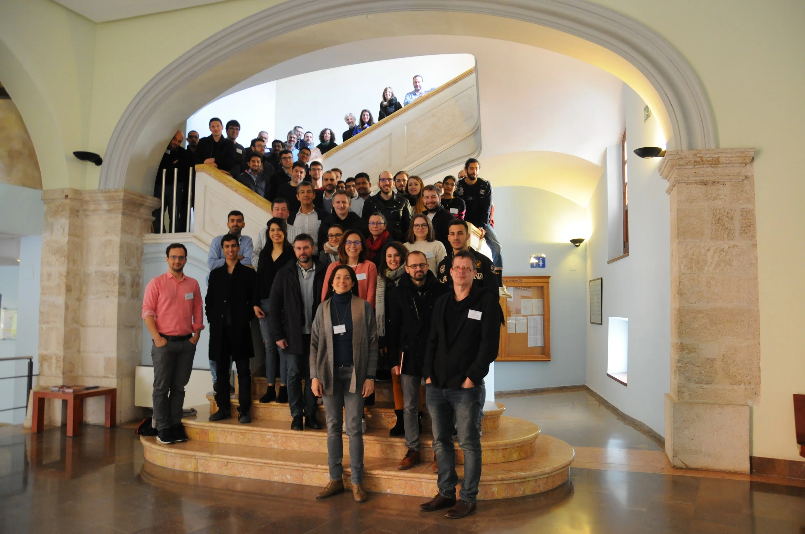
      </a>
    

  

  

    

      CπC11
      Zagreb, Croatia, 30.-01.02.2020
      
Organizer: Luca Grisanti, Aurora Ponzi Participants: 53

      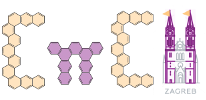
    

    

      <a href="#" onclick="openImagePopup('assets/images/cpic11_large.jpg', event)">
        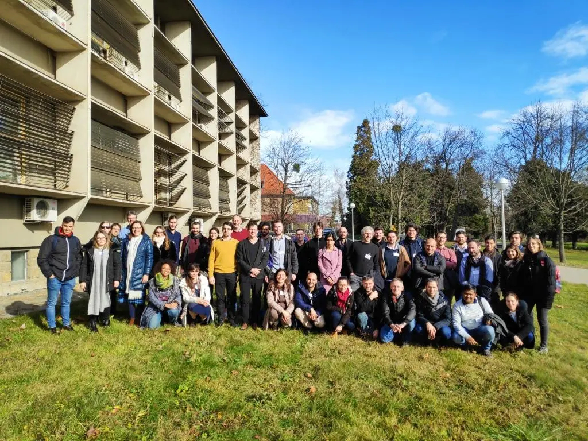
      </a>
    

  

  

    

      CπC Covid-19 edition
      Online, 18-20.01.2021
      
Organizer: G. d'Avino, L. Grisanti, G. Prampolini, M. Linares Participants: 100

    

    

      <a href="#" onclick="openImagePopup('assets/images/cpic_virtual.png', event)">
        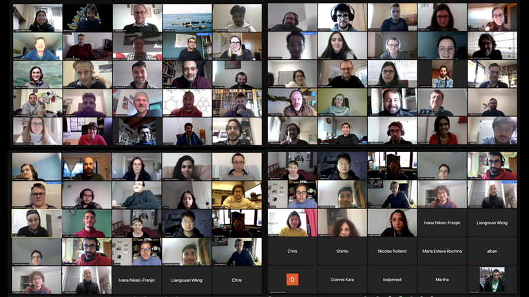
      </a>
    

  

  

    

      CπC12
      Grenoble, France, 12-14.05.2022
      
Organizer: Gabriele d'Avino Participants: 60

      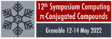
    

    

      
    

  

  

    

      CπC13
      Madrid, Spain, 26-28.01.2023
      
Organizer: Javier Cerezo, Lara Martínez Participants: 64

      
    

    

      <a href="#" onclick="openImagePopup('assets/images/cpic13_large.jpg', event)">
        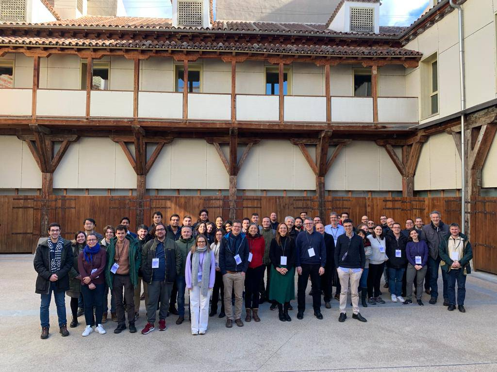
      </a>
    

  

  

    

      CπC14
      Donostia, Spain, 08-09.02.2024
      
Organizer: Claire Tonnelé Participants: 74

      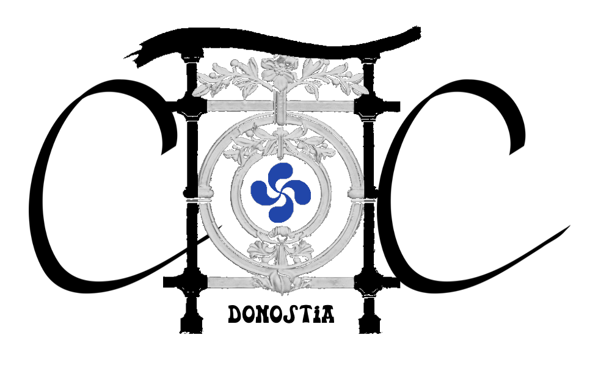
    

    

      
    

  

  <!-- Repeat the above structure for other photo items -->

 
 
<head>
  <meta charset="UTF-8">
  <title>Thin Line Example</title>
</head>
<body>
  

Next edition will take place in Siena, Italy. 
CπC15  :: Siena, Italy, 2025
</body>

  &times;
  

</body>
</html>
